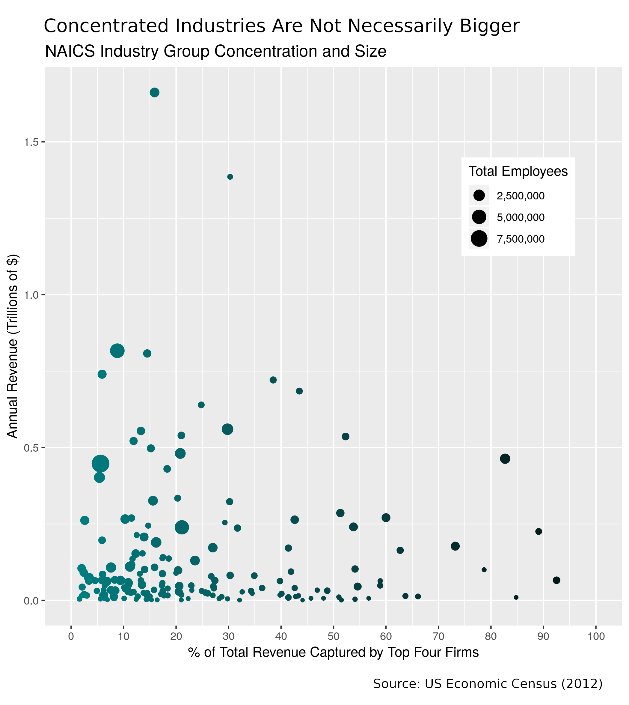
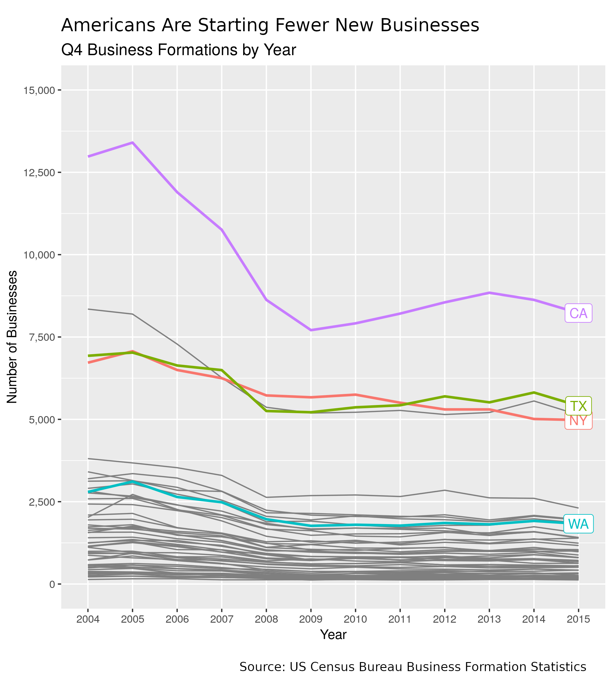

# The Monopolists Are Winning
Run `rake graphs` or just `rake` to generate the static graphs. These are
stored under `./static-graphs/raw`.

Touched-up versions of the raw graphs are stored under `./static-graphs/final`.

Use `rake report` to generate an RMarkdown report describing what the static
graphs tell you about market concentration in the US.

## A Selection of Static Graphs

