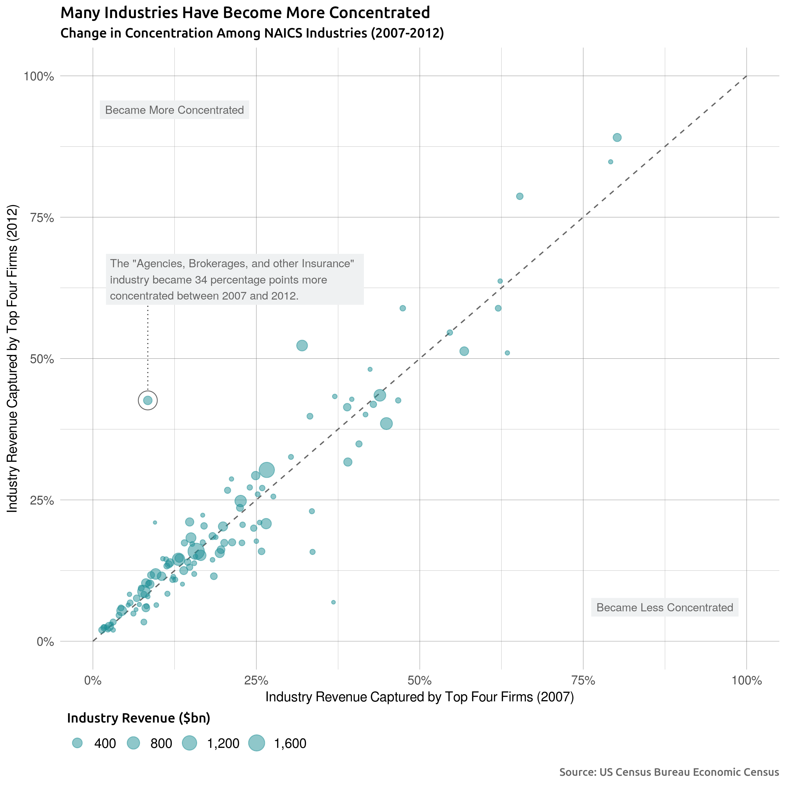

# The Monopolists Are Winning
Run `rake graphs` or just `rake` to generate the static graphs. These are
stored under `./static-graphs/raw`.

Touched-up versions of the raw graphs are stored under `./static-graphs/final`.

Use `rake report` to generate an RMarkdown report describing what the static
graphs tell you about market concentration in the US.

## Sources
Concentration ratio data is from the [US Census Bureau economic
census](https://www.census.gov/econ/concentration.html).

Business formation data is from [a separate business
formation](https://www.census.gov/programs-surveys/bfs/data/datasets.html)
dataset also maintained by the US Census Bureau.

The Consumer Finance Protection Bureau maintains a database of complaints
[here](https://www.consumerfinance.gov/data-research/consumer-complaints/).

## A Selection of Static Graphs

